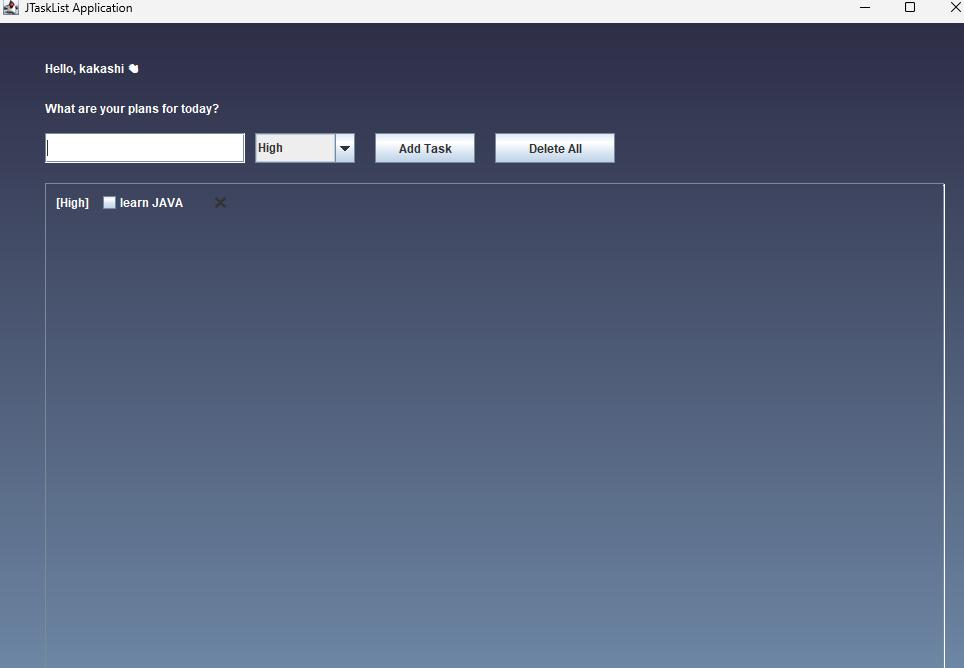

# 🗒️ JTaskList

A simple, tech-styled Java Swing GUI for tracking your daily tasks with priorities. Stay organized with a clean interface and handy controls.

---

## 🚀 Features

- **Personalized Greeting**  
  Welcomes you by name, e.g. “Hello, Name 👋”  
- **Add Tasks with Priority**  
  Select **High | Medium | Low** and see `[Priority]` labels in your list  
- **Delete Individual Tasks**  
  ❌ buttons let you remove any task at will  
- **Delete All at Once**  
  A “Delete All” button for a quick reset  
- **Tech-Styled UI**  
  - Gradient background from deep-space blue to sky  
  - Custom “Orbitron” font for a futuristic vibe  
- **Scrollable List**  
  Tasks stack neatly and scroll vertically  


---

## 📸 Screenshot



---

## 🛠️ Getting Started

### Prerequisites

- **Java 8+**  
- **Maven** (optional, for build & run conveniences)

### Installation

1. **Clone this repo**  
   ```bash
   git clone git@github.com:kakashxii/JTaskList.git
   cd JTaskListApp

2. **Run this in your project root (where JTaskListApp.java lives):**
    ```bash
    javac JTaskListApp.java

3. **Run:**
    ```bash
    java JTaskListApp


## ⚙️ Usage

1. **Enter your name and click Go.**

2. **Type a task, select its priority (High, Medium, Low), then click Add Task.**

3. **Check off completed items, delete an individual task with the ❌ button, or clear all tasks with Delete All.**


## 🤝 Contributing

Improvements are welcome!

1. **Fork this repo.**

2. **Clone your fork and cd into it.**

3. **Create a branch**

4. **Make your changes in JTaskListApp.java.**

5. **Compile & test locally**

6. **Commit & push your branch**

7. **Open a Pull Request against the main branch, describing your change.**


Thank you for contributing! 🎉


